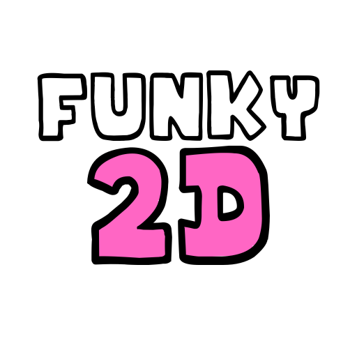

# Funky2D

THIS IS IN ALPHA. EXPECT DOO-DOO HITBOXES.
---
Funky2D is a recreation of FNF in Love2D. Instructions are below:

## Installation
- If you have L2D, Go to the cloned git repository.
- Run "love .". (Will only work once L2D is in your Path environment variable. <a href="https://windowsloop.com/how-to-add-to-windows-path/#:~:text=Add%20directory%20or%20program%20to%20Windows%20PATH%201,full%20directory%20path%20of%20the%20program.%20More%20items">Learn more</a>
- Done!

## Keybinds:
- Left: D
- Down: F
- Up: J
- Right: K

V1.0.1 alpha coming **soon...**
